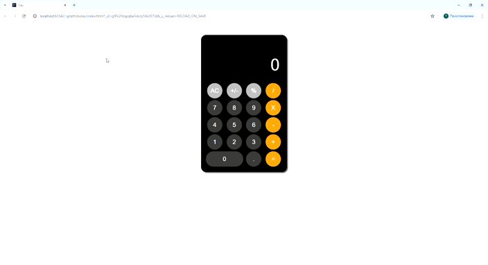

# JavaScript Калькулятор

## Описание
Это приложение-калькулятор на JavaScript, предназначенное для выполнения основных арифметических операций, такие как сложение, вычитание, умножение и деление. Приложение предоставляет простой веб-интерфейс для выполнения этих вычислений.
## Использование
Чтобы воспользоваться калькулятором, выполните следующие действия:

Калькулятор на JavaScript работает следующим образом:
1. Откройте HTML-файл в веб-браузере.
2. Вы увидите пользовательский интерфейс с дисплеем и кнопками для цифр и операций.
3. Используйте экранные кнопки для ввода чисел и операций (например,, 1, 2, +, -, *, /).
4. На дисплее отобразятся введенные числа и операции.
5. Нажмите кнопку "=", чтобы вычислить результат выражения.
6. Результат будет отображен на экране.
7. Чтобы очистить экран, нажмите кнопку "AC".

## Принцип работы
